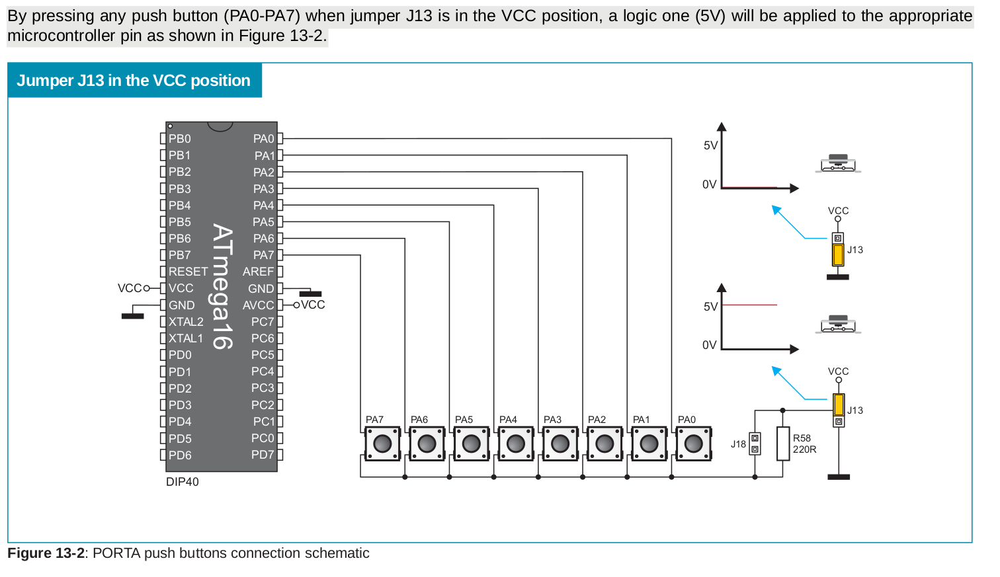

# MWE для исследования странного поведения стенда EasyAVR6 при работе с внешними прерываниями

## Оборудование

Стенд [EasyAVR6](http://www.rlx.sk/mikroelektronika/easyavr6_manual_v101.pdf) с микроконтроллером [ATmega16](http://ww1.microchip.com/downloads/en/devicedoc/doc2466.pdf).

Положение джамперов и переключателей можно оценить по следующей фотографии:

Схема подключения кнопок для **PD2**, **PD3** из официального руководства к EasyAVR6:

## Суть программы:

1. Зажечь на стенде **EasyAVR6** светодиоды, соответствующие **PA3-PA7**. 

2. При нажатии на кнопку **PD2**, соотв. вектору прерывания **INT0** светодиоды для **PA3-PA7** должны погаснуть.
   
	#define F_CPU 1000000
	#include <avr/io.h>
    #include <util/delay.h>
    #include <avr/interrupt.h>
       
    ISR(INT0_vect) {
       
    	/* Гасим светодиоды для порта А */
        PORTA=0x00;
    }
       
    int main(void)
    {
       
    	НАСТРОЙКА_ПОРТОВ_ВВОДА_ВЫВОДА;
        /* Зажигаем светодиоды для порта A */
        PORTA=0xF0;
        НАСТРОЙКА_ПРЕРЫВАНИЙ;
        while (1) 
        {
        }
       
     }

## Cуть странного поведения:

Странное поведение впервые зафиксировано автором во время участия во 2-й лабораторной работе по дисциплине "Схемотехника" 10.04.2021.

При нажатии на кнопку, соответствующую **PD2** cветодиоды для порта **A** должны гаснуть, *но при испытании на стенде этого не происходит*. 

При добавлении в код обработчика прерывания **INT0** команды `_delay_ms` было замечено, что *светодиоды гаснут лишь на время обусловленной ей задержки*.

Во время лабораторной работы проблему удалось решить лишь при помощи дополнительной глобальной переменной: ее значение изменялось в обработчике прерываний, а в основном цикле значение регистра **PORTA** менялось в зависимости от ее значения при помощи условного оператора. 

    #define F_CPU 1000000
    #include <avr/io.h>
    #include <util/delay.h>
    #include <avr/interrupt.h>
    
    unsigned char globalVar=0;
    ISR(INT0_vect) {
        /* Гасим светодиоды для порта А */
        globalVar=1;
    }
    
    int main(void)
    {
        НАСТРОЙКА_ПОРТОВ_ВВОДА_ВЫВОДА;
        PORTA=0xF0;
        НАСТРОЙКА_ПРЕРЫВАНИЙ;
        while (1) 
        {
            if (globalVar==1) PORTA=0x00;
        }
    }

## MWE

[MWE](https://en.wikipedia.org/wiki/Minimal_working_example) - наиболее простая программа минимального размера, демонстрирующая какую-либо ошибку. В рамках данного исследования подготовлено 2 версии такой программы: первая для джампера **J13** в положении **"VCC"** (ветка [J13_VCC](https://github.com/CodeDesign2763/EasyAVR_ATmega16_INT0_StrangeBehavior)), вторая для джампера **J13** в положении "GND" (ветка [J13_GND](https://github.com/CodeDesign2763/EasyAVR_ATmega16_INT0_StrangeBehavior/tree/J13_GND)). 

## План исследования

Первоначальная гипотеза о том, что в начале процедуры обработки прерывания **PORTA** заносится в стек, а затем, в конце процедуры, извлекается из него, *не подтвердилась*. Наиболее перспективным видится использование внутрисхемного программатора-отладчика с интерфейсом **JTAG** (вроде **JTAGICE**), т.к. соответствующий коннектор имеется на **EasyAVR6**. На следующей лабораторной работе планируется провести видеофиксацию странного поведения.   
