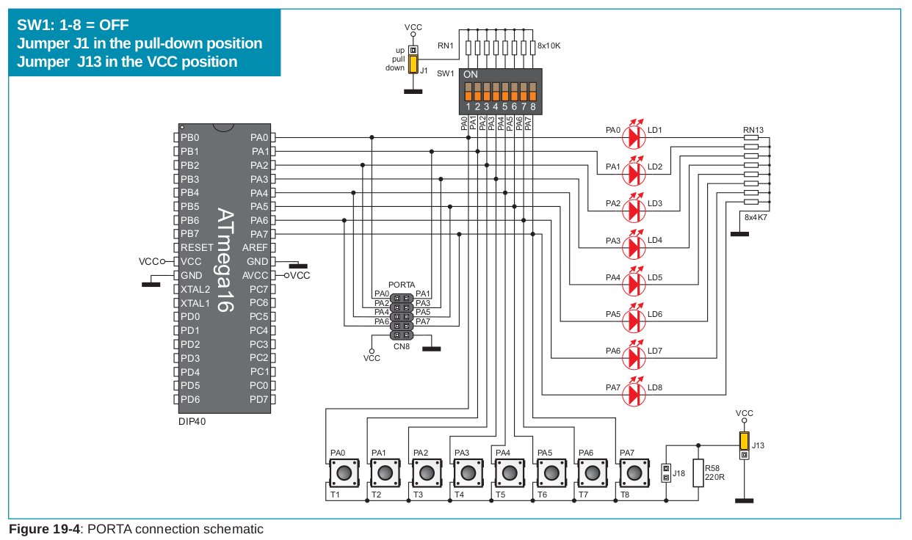
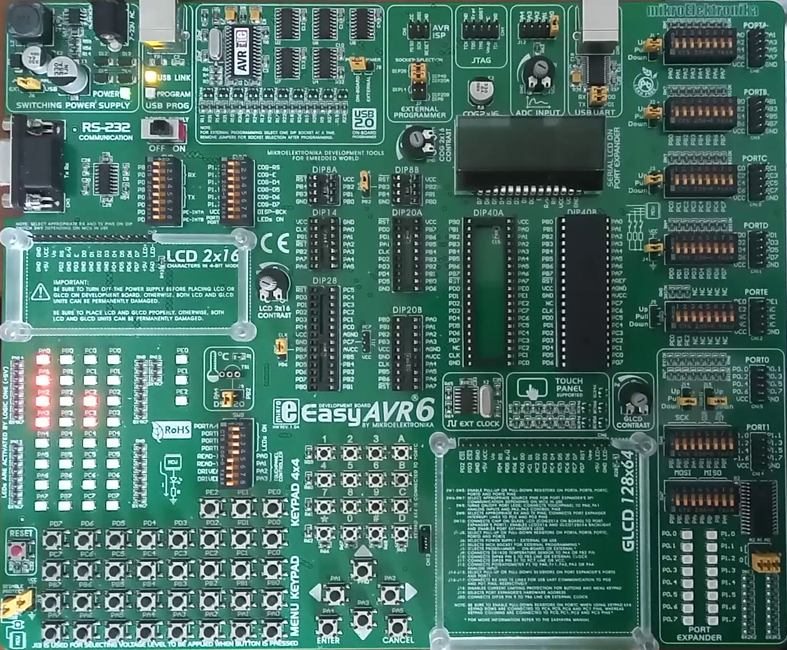
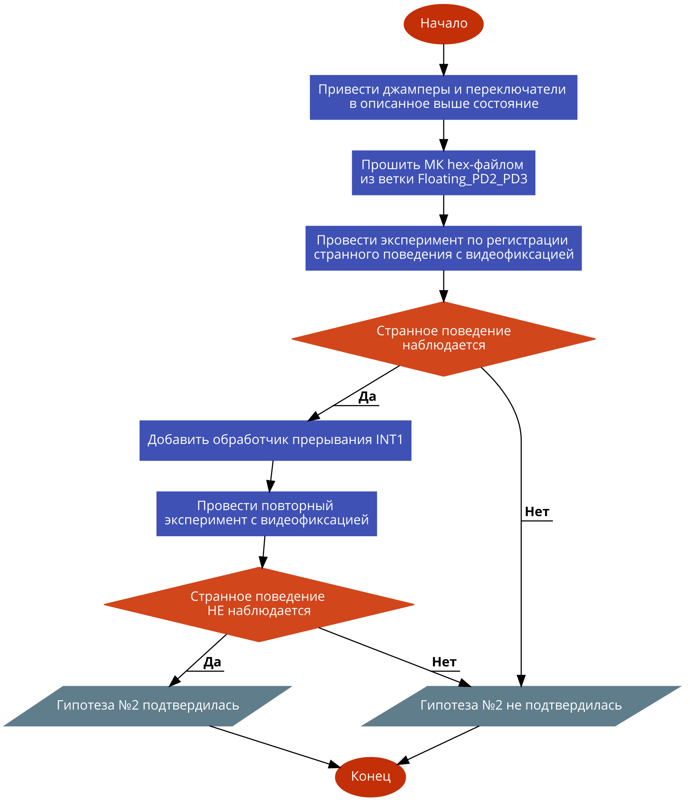

# MWE для исследования странного поведения стенда EasyAVR6 при работе с внешними прерываниями

## Оборудование

Стенд [EasyAVR6](http://www.rlx.sk/mikroelektronika/easyavr6_manual_v101.pdf) с микроконтроллером [ATmega16](http://ww1.microchip.com/downloads/en/devicedoc/doc2466.pdf).

Схема подключения кнопок для **PD2**, **PD3** из официального руководства к EasyAVR6:



Положение джамперов и переключателей можно оценить по следующей фотографии:



## Суть программы:

1. Зажечь на стенде **EasyAVR6** светодиоды, соответствующие **PA3-PA7**. 

2. При нажатии на кнопку **PD2**, соотв. вектору прерывания **INT0** светодиоды для **PA3-PA7** должны погаснуть.

```
#define F_CPU 1000000
#include <avr/io.h>
#include <util/delay.h>
#include <avr/interrupt.h>

ISR(INT0_vect) {

    /* Гасим светодиоды для порта А */
    PORTA=0x00;

}

int main(void)
{
    НАСТРОЙКА_ПОРТОВ_ВВОДА_ВЫВОДА;
    /* Зажигаем светодиоды для порта A */
    PORTA=0xF0;

    /* Настройка прерываний */
    /* Разрешение прерываний с векторами INT0 и INT1 */
    GICR |= (1 << INT1) | (1 << INT0);

    /* Срабатывание INT0 по спаду импульса */
    MCUCR |= (1 << ISC01) | (0 << ISC00);

    while (1) 
    {
    }

}
```

## Cуть странного поведения:

Странное поведение впервые зафиксировано автором во время участия во 2-й лабораторной работе по дисциплине "Схемотехника" 10.04.2021.

При нажатии на кнопку, соответствующую **PD2** cветодиоды для порта **A** должны гаснуть, *но при испытании на стенде этого не происходит*. 

При добавлении в код обработчика прерывания **INT0** команды `_delay_ms` было замечено, что *светодиоды гаснут лишь на время обусловленной ей задержки*.

Во время лабораторной работы проблему удалось решить лишь при помощи дополнительной глобальной переменной: ее значение изменялось в обработчике прерываний, а в основном цикле значение регистра **PORTA** менялось в зависимости от ее значения при помощи условного оператора. 

    #define F_CPU 1000000
    #include <avr/io.h>
    #include <util/delay.h>
    #include <avr/interrupt.h>
    
    unsigned char globalVar=0;
    ISR(INT0_vect) {
        /* Гасим светодиоды для порта А */
        globalVar=1;
    }
    
    int main(void)
    {
        НАСТРОЙКА_ПОРТОВ_ВВОДА_ВЫВОДА;
        PORTA=0xF0;
    
        /* Настройка прерываний */
        /* Разрешение прерываний с векторами INT0 и INT1 */
        GICR |= (1 << INT1) | (1 << INT0);
    
        /* Срабатывание INT0 по спаду импульса */
        MCUCR |= (1 << ISC01) | (0 << ISC00);
    
        while (1) 
        {
            if (globalVar==1) PORTA=0x00;
        }
    }

## MWE

[MWE](https://en.wikipedia.org/wiki/Minimal_working_example) - наиболее простая программа минимального размера, демонстрирующая какую-либо ошибку. В рамках данного исследования подготовлено 3 версии такой программы: ветка [J13_VCC](https://github.com/CodeDesign2763/EasyAVR_ATmega16_INT0_StrangeBehavior), ветка [J13_GND](https://github.com/CodeDesign2763/EasyAVR_ATmega16_INT0_StrangeBehavior/tree/J13_GND), ветка [Floating_PB2_PB3](https:////github.com/CodeDesign2763/EasyAVR_ATmega16_INT0_StrangeBehavior/tree/Floating_PB2_PB3). Наиболее близкой к оригинальному коду, вызывавшему странное поведение, является 3-я версия. Версия №2 предназначена для случая, когда джампер **J13** находится в положении **GND**.

## Исследование неопределенного поведения.

### Гипотеза №1

*В начале процедуры обработки прерывания содержимое регистра **PORTA** заносится в стек, а затем, в конце процедуры, извлекается из него.*

Гипотеза не подтвердилась.

### Гипотеза №2

Исследуем положение джамперов и переключателей с опубликованной выше схемы:

1. Джамперы **J1**- **J4** отключены.
2. Переключатели **SW1** и **SW4** находятся в состоянии **0xFF**
3. Джампер **J13** находится в положении **"VCC"**.

Очевидно, что находящиеся в режиме чтения выводы **PD2** и **PD3** не подтянуты к 0 и *"висят в воздухе"* при ненажатых кнопках, что делает поведение МК непредсказуемым.

Наиболее реалистичной кажется следующая гипотеза, объясняющее упомянутое выше странное поведение: 

1. В программе разрешены внешние прерывания **INT0** и **INT1**.
2. Обработчик прерывания объявлен лишь для **INT0**.
3. Выводы **PD2** и **PD3** не подтянуты к 0 и "висят в воздухе" при ненажатых кнопках.
4. При нажатии на кнопку **T26**, соответствующую **PD2**, также возникает прерывание **INT1**.
5. Возможные причины возникновения **INT1**: появление в цепи вывода **PD3** наводки при нажатии на кнопку **T26**, работа светодиода **LD27** в режиме фотодиода при свечении светодиода **LD26** на фоне отсутствия подтягивания к 0 вывода **PD3**.
6. Т.к. у регистра **SREG** бит **I=0**, а у **GICR** бит **INT1=1**, то у регистра **GIFR** биту **INTF1** присваивается 1.
7. Как только обработка прерывания **INT0** завершается, то у регистра **SREG** биту **I** присваивается 1 и начинается обработка прерывания **INT1**, т.к. у регистра **GIFR** бит **INTF1=1**.
8. Поскольку у **INT1** нет обработчика, как нет их и у прерываний с более низким приоритетом, управление передается на область памяти программ, заполненную нулями, которые интерпретируются как инструкции **NOP**, которая предшествует основной программе.
9. После выполнения этих инструкций **NOP** микроконтроллер начинает выполнять основную программу, в начале которой восстанавливается исходное значения регистра **PORTA**, что полностью отменяет все изменения, произведенные в обработчике прерывания **INT0**.

### План эксперимента



Данная блок-схема создана при помощи автоматического генератора блок-схем [Code2Flow](https://app.code2flow.com/). [Код](./block_diagr_exp.code2flow) блок-схемы.
